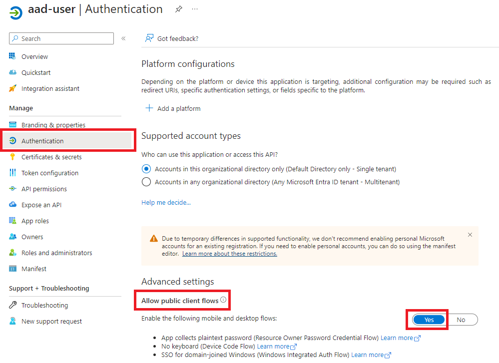

# Configure OIDC with Entra ID on a Self-Managed cluster

## 1. Register an Application in Azure AD

### a. Create an AAD Enterprise Application and the Corresponding App Registration

* Go to the Azure portal, navigate to Azure Active Directory > App registrations > New registration
* Provide a name for the application, select the supported account types, and provide a redirect URI
* After the application is registered, note down the Application (client) ID and the Tenant ID. These will be used in the Kubernetes configuration

### b. Add Configurations to Your Application Registration

* Go to your App Registration > Authentication > Toggle "Allow public client flows" to "Yes"



* Go to your App Registration > Token Configuration > Add Groups Claim > Select Security Group > Save


### c. Add a Security Group in Entra

* Navigate to Microsoft Entra ID > Groups > New Group
* Provide a group name, description, and add the necessary members > Create
* Make a note of the Object ID of your group. You will need to use this when adding your role binding(s)


## 2. Configure the Kubernetes API Server

You will need the following flags configured as API server args on your cluster:

```
oidc-issuer-url: https://sts.windows.net/<YOUR_AZURE_AD_TENANT_ID>/
oidc-client-id: <YOUR_AZURE_AD_CLIENT_ID>
oidc-username-claim: oid
oidc-groups-claim: groups
```

Make sure to replace `<YOUR_AZURE_AD_CLIENT_ID>` and `<YOUR_AZURE_AD_TENANT_ID>` with the values noted down in the previous steps. An example can be found in [cluster-config.yaml](./cluster-config.yaml).

You can see the Kubernetes documentation for optional flags: https://kubernetes.io/docs/reference/access-authn-authz/authentication/#configuring-the-api-server.

## 3. Set the credentials for the Azure user

Exec plugin is one of Kubernetes authentication strategies which allows kubectl to execute an external command to receive user credentials to send to api-server. To interact with an Azure AD enabled Kubernetes cluster, Exec plugin using kubelogin will be required. When using kubelogin in Exec plugin, the kubeconfig tells kubectl to execute kubelogin get-token subcommand to perform various Azure AD login modes to get the access token.

You can configure the exec plugin with kubelogin to use the application from the first step by running the following command:

```
kubectl config set-credentials "azure-user" \
  --exec-api-version=client.authentication.k8s.io/v1beta1 \
  --exec-command=kubelogin \
  --exec-arg=get-token \
  --exec-arg=--environment \
  --exec-arg=AzurePublicCloud \
  --exec-arg=--server-id \
  --exec-arg=<YOUR_AZURE_AD_CLIENT_ID> \
  --exec-arg=--client-id \
  --exec-arg=<YOUR_AZURE_AD_CLIENT_ID> \
  --exec-arg=--tenant-id \
  --exec-arg=<YOUR_AZURE_AD_TENANT_ID>
```

## 4. Add the Necessary RoleBinding or ClusterRoleBinding

An example can be found in [group-role-binding.yaml](./group-role-binding.yaml). Make sure to replace the apiGroup name `<YOUR_GROUP_OBJECT_ID>` with the Object Id associated with the group you created in Entra.

Don't forget to apply your role bindings with the following command:

```
kubectl apply -f group-role-binding.yaml
```

## 5. Use the Credential to Connect to the Cluster


First, set your context to use the user that you just added:

```
kubectl config set-context "$CLUSTER_NAME" --cluster="$CLUSTER_NAME" --user=azure-user
kubectl config use-context "$CLUSTER_NAME"
```

Now, you are ready to test! You can interact with your cluster as you normally would. Please note that you will be prompted to login to Azure using your credentials.
